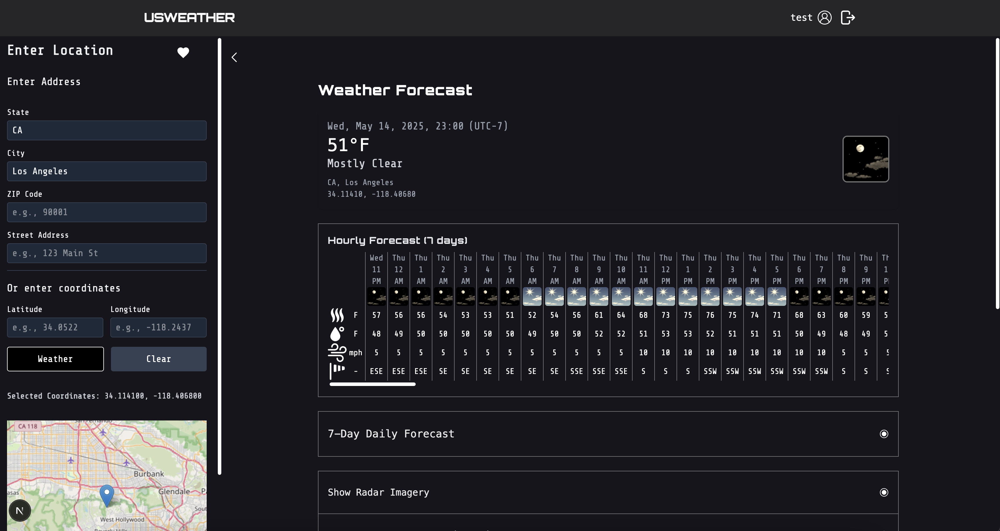

# Rainman

## Description

**Rainman** (officially named [USWeather](https://www.usweather.info)) is a weather app for US locations. The user can select a location and check the current weather and the forecast for the next 7 days, as well as some climate data for the location. The hourly weather forecast is _"updated every hour approximately 5 minutes after the hour"_1.

## Data Sources

**NOAA** (National Oceanic and Atmospheric Administration) provides the weather2 and climate3 data for the app. The APIs are free US government services. The weather data is updated every hour. Radar imagery as well as satellite imagery, like the GeoColor CONUS4 view are updated more frequently. Climate data is from the last 10 years, if available. Otherwise older data is displayed.

## UI

Walkthrough of the app is available [here](https://youtu.be/FxEJKzEaJlM).

## Usage

Select a location by selecting a state, a city, a state and a city or any of the following:
street+city+state+zip,
street+city+state,
street+state+zip,
street+city+zip.

Zip code, street addresss, or street address and zip code alone will not work. The app will not return any results. The app will also not return any results if the location is not in the US.

You can also enter latitude and longitude values or select a location from a map.

After selecting a location, fetch the weather and climate data.

## Notes

The NOAA Climate API returns 50x errors quite often, so climate data will not always be available.

If you are interested in all the available NOAA weather and radar stations in the US, and why wouldn't you be, they can be viewed here: [NOAA US Weather Stations](https://docs.google.com/spreadsheets/d/1NrUjMkiUXB8YeAdnQPpog1fnciE--neEKWUW1YAx_i8/edit?usp=sharing) and
[NOAA US Radar Stations](https://docs.google.com/spreadsheets/d/12Y--CBWJCfabfY0aU9gOp4bUQG4ahxYN0nhqmvYJWno/edit?usp=sharing). The tables are updated infrequently.

## License

All Rights Reserved _jouniverse_ 2025.

## References

1[NOAA Weather API General Information](https://www.weather.gov/gid/nwr_general)
2[NOAA Weather API](https://www.weather.gov/documentation/services-web-api#/)
3[NOAA Climate API](https://www.ncdc.noaa.gov/cdo-web/webservices/v2)
4[GeoColor Product](https://www.star.nesdis.noaa.gov/goes/documents/QuickGuide_CIRA_Geocolor_20171019.pdf)
